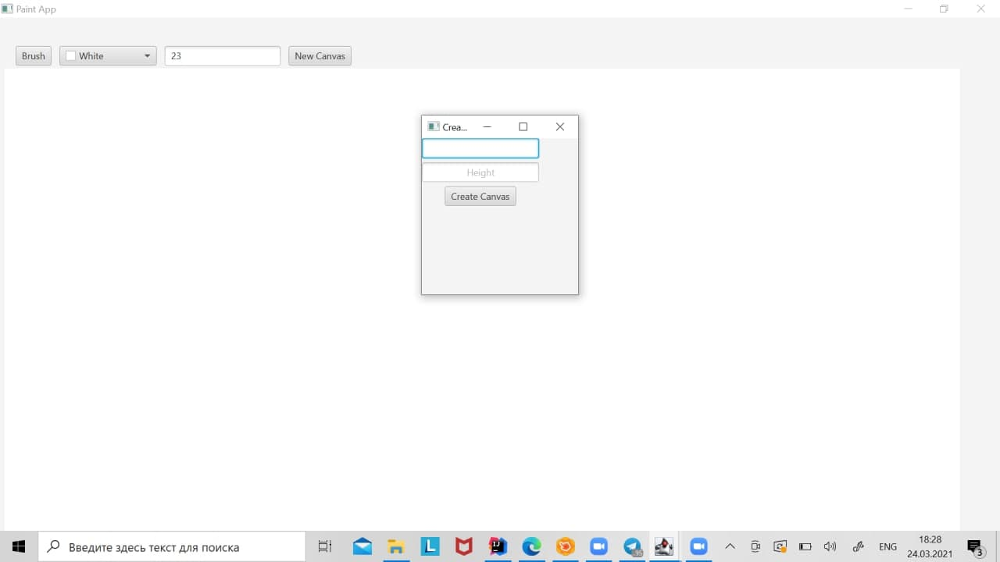

# PAINT
<i>Was created by Altynbek kyzy Zhainagul</i>
<h6></h6>

<i>Paint app is a simple application where you can draw your own drawings and paint them.</i>

<i>This project was generated with JavaFX, CSS and Scene Builder.</i>

<h2><b>Features</b></h2>

<i> • Create Drawings (Obvious one :P).</i>

<i> • Select different brush sizes. </i>

<i> • Select your working areas width and height. </i>

<i> • Color pallet.</i>

<i> • Save drawings in Gallery.</i>

The presentation of my project on you tube: 

<b> •• <a href="https://youtu.be/FasWHdO3rSQ">VIDEO</a> ••</b>
